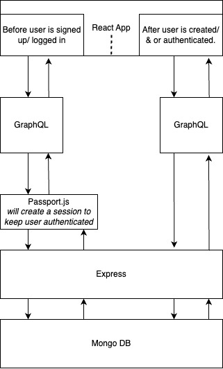

# A small React project initaitalising users and structuring their data via GraphQL

This is a react-based project allowing a user to create a profile, login and logout of a dashboard. It can accomodate multiple users.

I have built it in to be used to add multiple user functionality to other apps i build when nessecary, it is not designed to be used as a stand alone app.

# Some key technologies used:
- React 15 for front end components (generally building with class based components)
- GraphQL schemas to organise the data structures
- Apollo & react- apollo libraries to integrate GraphQL into React
- Passport.js to handle the user authentication.
- Express to handle server-side logic
- MongoDB for database storage & retrieval.

### Setup
- There is only a dev mode, as it is not nessecary to use as a stand alone program, it would only be used in conjunction with other tools.
- Run `npm install --legacy-peer-deps` in the root of the project to install dependencies
- Run `npm run dev` to run the app (as it is not its own standalone app i haven't created a non-dev based runtime as yet)
- Access the app at `localhost:4000` in your browser
  
# Still to do

- add additional password authentication in Signup, so the user must enter the same password twice (to be added to the frontend component).
- add additional email and password authentication in Signup so a user must use a valid email address and a password of numbers and letters at least 6 characters long.

# A diagram of the data flow around the app:

# A diagram of the component hierarchy:

